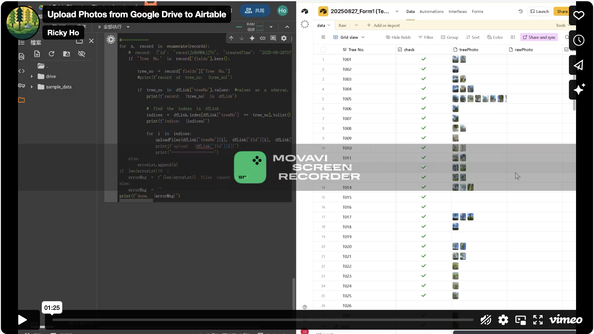
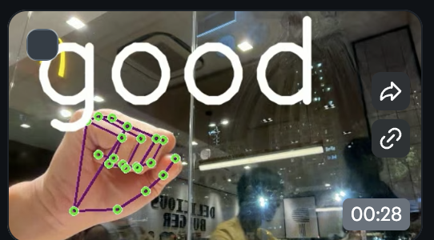

# Python Tools

**Mini Projects**
========================================

1. __Automated Photo Uploads to Airtable__:  
  
This program enables users to upload photos from Google Drive to Airtable, streamlining data management for field surveys. It boosts efficiency by simplifying historical data updates and enhances organization, creating a practical solutions that optimize workflow. 

2. __RPA Data Entry Application__:  
 

3. __Interactive web map__: https://hydslpss.netlify.app/  
  
(This project displays Google Street View based on location, using the Hong Kong government map as a base layer. It was my first programming project, and I dedicated significant time to its development. The static interactive web map takes about 20 seconds to load and runs smoothly on mobile devices compared to computers. Google street view is support"ed on the application.)  

4. __Interactive web map integrated with anvil__: https://dependable-kosher-curlew.anvil.app/  
   
(Anvil is a low code web app platform for python development, i also add a dashboard https://2024tram10f2.netlify.app/ into this app for analysis) 

5. __gestureRecongition__:  
  
In addition to traditional OCR detection, Google has developed a library for detecting gestures using 21 3D landmarks on the hands, utilizing OpenCV to identify these points during video capture (credit: Oxxo Studio https://steam.oxxostudio.tw/category/python/ai/ai-mediapipe-2023-hand.html).
I have made some modifications to identify hand gestures in photos, which helps automate the naming and classification of images based on the gestures made after a photo is taken.

6. __whatsappNotification__:  
This small application connects to Google Sheets to track upcoming due dates. It sends WhatsApp messages to users when a due date is approaching—specifically, within three days to the deadline. I have deployed it on AWS Lambda for automation, which incurs no daily running costs.

**Overview**
========================================
Welcome to my project! This repository contains a Python script that automates the upload of photos from Google Drive to Airtable, designed specifically for field surveys. It utilizes RPA to minimize tedious manual processes and includes a web map for monitoring and managing large-scale locations. As a dedicated bootcamp student transitioning from an arboricultural background to the tech industry, I am eager to leverage technology to address practical challenges. 

I welcome contributions! If you have suggestions or improvements, please feel free to open an issue or submit a pull request. 

Future Aspirations
As I continue to grow in the developer industry, I am eager to learn and embrace new challenges. I believe in the power of technology to drive positive change, and I look forward to contributing to innovative solutions. 

Thank you for exploring my project!
