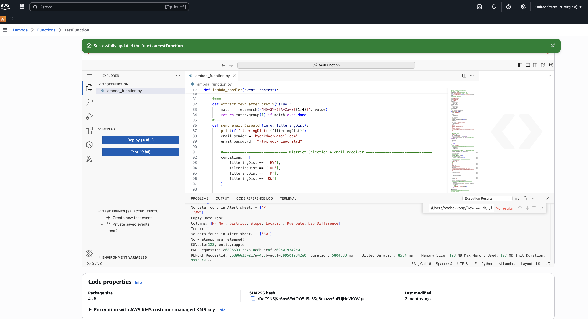

# Python Tools

**This project includes folders for Mini Projects and Colab**
========================================

1. __Automated Photo Uploads to Airtable__: https://vimeo.com/manage/videos/1115064992 
  
This program enables users to upload photos from Google Drive to Airtable, streamlining data management for field surveys. It boosts efficiency by simplifying historical data updates and enhances organization, creating a practical solutions that optimize workflow. 

2. __RPA Data Entry Application__: https://vimeo.com/manage/videos/1114613957 
 
Robotic Process Automation (RPA) can alleviate the burden of manual data entry and significantly reduce the risk of errors in user interfaces. In batch data entry processes, Excel tables serve as an effective storage solution, while automation can be achieved using the pyautogui library. Adopting Excel tables provides a straightforward and user-friendly means of data editing, facilitating efficient data input and streamlining workflows. This approach enhances overall accuracy and productivity.

3. __Interactive web map__: https://hydslpss.netlify.app/  
  
(This project displays Google Street View based on location, using the Hong Kong government map as a base layer. It was my first programming project, and I dedicated significant time to its development. The static interactive web map takes about 20 seconds to load and runs smoothly on mobile devices compared to computers. Google street view is support"ed on the application.)  

4. __Interactive web map integrated with anvil__: https://dependable-kosher-curlew.anvil.app/  
   
(Anvil is a low code web app platform for python development, i also add a dashboard https://2024tram10f2.netlify.app/ into this app for analysis) 

5. __Hand Gesture Recongition__: https://vimeo.com/1117408999 
  
In addition to traditional OCR detection, Google has developed a library for detecting gestures using 21 3D landmarks on the hands, utilizing OpenCV to identify these points during video capture (credit: Oxxo Studio https://steam.oxxostudio.tw/category/python/ai/ai-mediapipe-2023-hand.html).
I have made some modifications to identify hand gestures in photos, which helps automate the naming and classification of images based on the gestures's photo made after a photo is taken.

6. __Whatsapp Notification__:  
 
This small application connects to Google Sheets to track upcoming due dates. It sends WhatsApp messages to users when a due date is approaching—specifically, within three days to the deadline. I have deployed it on AWS Lambda for automation, which incurs no daily running costs.

7. __Real use case for K-means Clustering__:  
 
This mini-project showcases a practical application of K-means clustering in the field of tree management. K-means clustering is a fundamental machine learning technique used to group data points based on their similarities, and in this project, I apply it to geolocation effectively.
In tree management system, the geolocation data of trees can be categorized into up to 50 clusters, each representing a distinct group of trees. This approach adheres to the requirement established by the Tree Management Office of HK government, which mandates that each tree group be limited to 50 clusters of similar size. By implementing the K-means clustering method, we can efficiently manage and analyze tree populations, facilitating better decision-making in urban forestry and environmental conservation efforts.
This project not only highlights the practical utility of K-means clustering but also demonstrates my ability to apply machine learning concepts to real-world scenarios.

**Overview**
========================================
Welcome to my project! This repository contains a Python script that automates the upload of photos from Google Drive to Airtable, designed specifically for field surveys. It utilizes RPA to minimize tedious manual processes and includes a web map for monitoring and managing large-scale locations. As a dedicated bootcamp student transitioning from an arboricultural background to the tech industry, I am eager to leverage technology to address practical challenges. 

I welcome contributions! If you have suggestions or improvements, please feel free to open an issue or submit a pull request. 

Future Aspirations
As I continue to grow in the developer industry, I am eager to learn and embrace new challenges. I believe in the power of technology to drive positive change, and I look forward to contributing to innovative solutions. 

Thank you for exploring my project!

====
# Note of my interactive web map

## Summary of FoliumHKI_Release.ipynb

**Purpose:**  
This Jupyter notebook is designed for working with geospatial data related to Hong Kong, focusing on trees, slopes, districts, bus stops, and public works. It leverages Google Colab for cloud execution, integrates with Google Drive, and uses the Folium library (along with extensions) to visualize spatial data on interactive maps.

---

## Key Components

### 1. **Setup and Mounting**
- **Google Drive Mount:**  
  The notebook mounts Google Drive to access and store data files, configuration files, and outputs.
- **Authentication:**  
  Authenticates with Google for access to Google Sheets and Drive.

### 2. **Package Installation**
- Installs required Python packages:  
  - **geopandas**: for geospatial data handling
  - **folium**, **foliumEllipsis**, **folium-vectortilelayer**: for interactive mapping
  - **fiona**, **htmlmin**, **netlify-python**, **openpyxl**, **pathlib**, **numpy** and others

### 3. **Configuration Import**
- Loads custom configuration parameters from a Python config file in the mounted Drive (e.g., paths, sheet IDs).

### 4. **Data Preparation**
- **Lists and Paths:**  
  Sets up lists of Hong Kong districts, departments, and other categorical data.
- **File and Resource Paths:**  
  Organizes download, resource, and output directories for data files.

### 5. **Downloading GeoJSON Data**
- Uses `wget` to download multiple GeoJSON/zip files from the Hong Kong CSDI portal, including:
  - Slope data (`Slpgeojson`, `SlpSubgeojson`, `SubstandardSlp`)
  - District boundaries (`AdmDist`, `LPgeojson`)
  - Bus stop locations (`BusStop`)
  - Excavation works (`ExcavationWorks`)

### 6. **Data Loading and Processing**
- **Unzipping and Reading Files:**  
  Reads zipped shapefiles and GeoJSON files into GeoPandas dataframes.
- **Google Sheets Integration:**  
  Loads tree data (SWT) directly from a Google Sheet into a dataframe, filters and processes the columns, assigns colors and icons for mapping.
- **Districts, Slopes, Bus Stops:**  
  Reads and prints metadata for these datasets, showing available columns and unique values.

### 7. **Map Preparation (Implied)**
- The notebook sets up all required spatial dataframes for further visualization in Folium.
- While the provided content does not include the actual Folium map creation steps, the setup enables interactive mapping of:
  - Trees (with species, health, and location)
  - Bus stops
  - District boundaries
  - Slope and substandard slope data
  - Excavation/public works

---

## Typical Use Cases

- **Urban Tree Management:**  
  Visualizing tree inventories, health, and maintenance districts.
- **Slope Risk Mapping:**  
  Displaying locations and attributes of slopes, including substandard areas.
- **District Analysis:**  
  Overlaying administrative and landscape boundaries for planning and analysis.
- **Public Transport:**  
  Mapping bus stops for accessibility studies.
- **Public Works:**  
  Showing locations of excavation or construction works.

---

## Technologies Used

- **Python Libraries:** geopandas, pandas, numpy, folium, fiona, htmlmin, netlify-python, openpyxl, pathlib
- **Google Colab and Drive:** for cloud execution and storage
- **Google Sheets:** for real-time data integration
- **Hong Kong CSDI:** as a source of official geospatial datasets

---

## Notes

- The notebook is modular, allowing for easy addition of new spatial datasets.
- The configuration-driven approach (with external config files) makes it adaptable for different analyses and regions.
- Mapping functionality is likely built in later cells (not shown in the provided context), using Folium to create interactive web maps.
 
